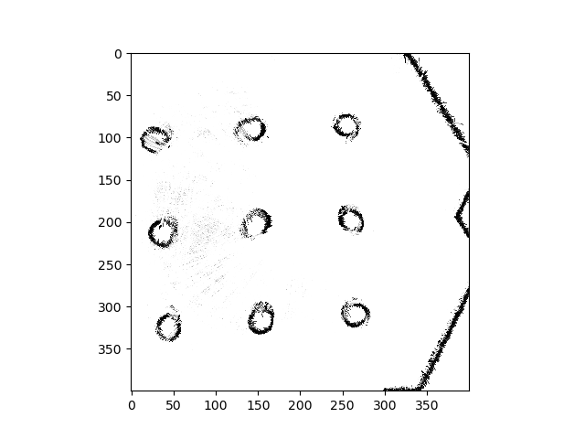

# Task 1

## Picture of the AMCL rviz window with a converged filter

## Minimum number of particles required for successful localization

Default values:
- min_particles: 500
- max_particles: 3000

Try 1:
- min_particles: 100
- max_particles: 500
- localized fine

Try 2:
- min_particles: 10
- max_particles: 50
- starting to struggle

Try 3:
- min_particles: 50
- max_particles: 250

Seems like aroune Try 2 - Try 3 is the minimum amount.

## Maximum odom_alpha parameters before localization failed

Default values:
- odom_alpha1: 0.1
- odom_alpha2: 0.1
- odom_alpha3: 0.1
- odom_alpha4: 0.1
- odom_alpha5: 0.2, not actually used (only for omni-directional robots)

Try 1:
- 5 for all
- does not converge

Try 2:
- 2.5 for all
- closer, but not really converged

Try 3:
- 1.25 for all
- closer, but not really converged

Try 4:
- 0.625 for all
- almost converged

Try 5:
- 0.3125 for all
- convered

Somewhere between try 4 and try 5 we get the maximum odom alpha

# Task 2

## Picture of Lab3 map and your new map

### Lab 3 map

### New Map

## How did localization component of gmapping improve the new map compared to lab 3

- more robust to "driving errors" e.g., collision, high rotation acceleration. It can more easily correct itself
- Drift correction: fusion of sensor data and loop closure remove this issue
- Global consistency: gmapping map is globally consistent (optimize entire map), lab3 map is not due to drift

# Task 3

## Present map and map provided for lab 2

### Lab 2

### Gmapping

TODO

## compare map to corresponding part of the map from lab 2

## describe any issues that you encountered when you attempt to close a loop (or expected to encounter)

Issues: insufficient overlap to recongize a loop closure -> loop was not closed.

# Task 4

## Present your map of myhal

## Describe any mapping issues you encounted and discuss their cause. discuss any diffs between real life deployment and sim

# Appendix: GPT 4 answers

Q:
How does the AMCL mapping algorithm work?

A:
The Adaptive Monte Carlo Localization (AMCL) algorithm is an extension of the basic Monte Carlo Localization (MCL) algorithm. AMCL dynamically adjusts the number of particles used in the particle filter based on the uncertainty of the robot's pose estimate. By doing so, AMCL aims to improve the efficiency and accuracy of the localization process.

The main steps of the AMCL algorithm are similar to those of the basic MCL algorithm, with the addition of an adaptive resampling step. Here is an overview of the AMCL algorithm:

Initialization: A set of particles is initialized randomly or based on prior knowledge of the robot's pose. Each particle is assigned an initial weight.

Motion Update: When the robot moves, the particles are updated based on the robot's motion model. This step involves predicting the new pose of each particle based on the robot's control commands and adding some noise to account for uncertainties in the robot's motion.

Sensor Update: The robot takes sensor measurements (e.g., range measurements from a laser rangefinder) and updates the weights of the particles based on how well the measurements match the expected sensor readings for each particle's pose. Particles with sensor readings that closely match the expected values receive higher weights.

Adaptive Resampling: The algorithm calculates the effective sample size (ESS), which is a measure of the diversity of the particles. If the ESS falls below a certain threshold, resampling is performed. Particles with low weights are replaced by duplicating particles with high weights. This step ensures that particles with higher likelihoods are retained, while unlikely particles are discarded. The number of particles used in the filter is adapted based on the uncertainty of the pose estimate. When the uncertainty is high (e.g., during global localization or when the robot is lost), more particles are used. When the uncertainty is low (e.g., when the robot is well localized), fewer particles are used.

Estimation: The estimated pose of the robot is computed as the weighted average of the particles' poses.

The AMCL algorithm is iterative and is repeated as the robot moves and takes sensor measurements. Over time, the particles converge to the true pose of the robot, resulting in an accurate estimate of the robot's position and orientation.

The key advantage of AMCL over basic MCL is its ability to adapt the number of particles based on the uncertainty of the localization estimate. This adaptation allows AMCL to use computational resources more efficiently, making it suitable for real-time localization on mobile robots with limited computational power. Additionally, the adaptive nature of AMCL allows it to handle challenging localization scenarios, such as global localization and the "kidnapped robot" problem, where the robot is suddenly moved to an unknown location.

Q:
Explain the following parameters in AMCL:
1. max_particles
2. min_particles
3. all of the odom_alpha parameters?

A:
max_particles: This parameter specifies the maximum number of particles that the Adaptive Monte Carlo Localization (AMCL) algorithm is allowed to use in the particle filter. The algorithm dynamically adjusts the number of particles based on the uncertainty of the robot's pose estimate, but the number of particles will never exceed this maximum value. A higher value for max_particles allows for greater diversity in the particle set and can improve localization accuracy, especially in situations with high uncertainty. However, using a larger number of particles also increases computational complexity, so this parameter should be chosen with consideration for the available computational resources.

min_particles: This parameter specifies the minimum number of particles that the AMCL algorithm is allowed to use in the particle filter. Similar to max_particles, the algorithm dynamically adjusts the number of particles based on the uncertainty of the robot's pose estimate, but the number of particles will never fall below this minimum value. A lower value for min_particles reduces computational complexity, but it may also reduce localization accuracy if there is not enough diversity in the particle set. This parameter should be chosen with consideration for the desired trade-off between accuracy and computational efficiency.

odom_alpha parameters: The odom_alpha parameters (typically denoted as odom_alpha1, odom_alpha2, odom_alpha3, and odom_alpha4) are used to model the noise in the robot's odometry motion model. These parameters characterize the uncertainty associated with the robot's motion and are used to add noise to the predicted motion of each particle during the motion update step of the AMCL algorithm. The specific meaning of each odom_alpha parameter is as follows:

odom_alpha1: This parameter models the noise in the robot's rotational motion proportional to the amount of rotation. It represents the uncertainty in the robot's rotation that is due to rotational motion.
odom_alpha2: This parameter models the noise in the robot's rotational motion proportional to the amount of translation (linear motion). It represents the uncertainty in the robot's rotation that is due to linear motion.
odom_alpha3: This parameter models the noise in the robot's linear motion proportional to the amount of translation. It represents the uncertainty in the robot's linear motion that is due to linear motion.
odom_alpha4: This parameter models the noise in the robot's linear motion proportional to the amount of rotation. It represents the uncertainty in the robot's linear motion that is due to rotational motion.
The odom_alpha parameters are typically determined empirically based on the characteristics of the robot's motion and sensors. Proper tuning of these parameters is important for achieving accurate localization results.

Q:
How does SLAM like gmapping improve upon odometry-based mapping?

A:
Simultaneous Localization and Mapping (SLAM), such as gmapping, improves upon odometry-based mapping by addressing the inherent limitations of odometry and providing a more accurate and complete map of the environment. The key differences and improvements offered by SLAM compared to odometry-based mapping are as follows:

Drift Correction: One of the main limitations of odometry-based mapping is the accumulation of errors over time, known as "drift." Odometry errors arise from factors such as wheel slippage, uneven terrain, and sensor noise. These errors accumulate as the robot moves, leading to an increasingly inaccurate estimate of the robot's pose. SLAM algorithms, such as gmapping, address this issue by using sensor data (e.g., laser scans) to match observations with the map and correct the robot's pose estimate. This process, known as "loop closure," allows SLAM to recognize when the robot revisits a previously mapped area and correct accumulated drift.

Global Consistency: Odometry-based mapping relies solely on relative motion measurements, which can result in maps that are locally consistent but globally inconsistent. SLAM algorithms, on the other hand, aim to achieve global consistency by optimizing the entire map and trajectory. SLAM uses sensor data to align and adjust the map so that it is consistent with the observations, even when revisiting previously mapped areas.

Environment Mapping: While odometry provides information about the robot's motion, it does not provide information about the environment. SLAM algorithms use sensor data (e.g., laser rangefinders, cameras) to build a detailed map of the environment. This map includes information about obstacles, walls, and other features, making it useful for navigation and path planning.

Robustness to Uncertainty: Odometry-based mapping is sensitive to uncertainties in the robot's motion and is prone to errors when the robot's motion model is not accurate. SLAM algorithms incorporate probabilistic techniques, such as particle filters or graph optimization, to handle uncertainties in both motion and sensor measurements. This makes SLAM more robust to noise and uncertainty.

Handling Dynamic Environments: While odometry-based mapping struggles with dynamic environments where objects move, some SLAM algorithms can handle dynamic changes in the environment by distinguishing between static and dynamic features. This capability allows SLAM to build maps that are more accurate and reliable in dynamic settings.

Overall, SLAM algorithms like gmapping provide a comprehensive solution for both localization and mapping, allowing robots to operate autonomously in unknown environments with greater accuracy and reliability than odometry-based mapping alone.

Q:
What are the parameters srr, srt, str, and stt in gmapping?

A:
In the gmapping package, the parameters srr, srt, str, and stt are used to model the noise in the robot's odometry. These parameters represent the standard deviations of the noise associated with different components of the robot's motion. Specifically, they are used to model the uncertainty in the robot's pose estimate based on its odometry readings.

Here is what each of these parameters represents:

srr (Standard Deviation of Rotation given Rotation): This parameter represents the standard deviation of the noise in the robot's rotation estimate when the robot is rotating. It models the uncertainty in the robot's rotation angle when the robot is executing a rotational motion.

srt (Standard Deviation of Rotation given Translation): This parameter represents the standard deviation of the noise in the robot's rotation estimate when the robot is translating (moving in a straight line). It models the uncertainty in the robot's rotation angle when the robot is executing a translational motion.

str (Standard Deviation of Translation given Rotation): This parameter represents the standard deviation of the noise in the robot's translation estimate when the robot is rotating. It models the uncertainty in the robot's linear displacement when the robot is executing a rotational motion.

stt (Standard Deviation of Translation given Translation): This parameter represents the standard deviation of the noise in the robot's translation estimate when the robot is translating. It models the uncertainty in the robot's linear displacement when the robot is executing a translational motion.

These parameters are used to model the odometry noise in the particle filter implemented by gmapping. Properly tuning these parameters can help improve the accuracy of the SLAM (Simultaneous Localization and Mapping) process. The values of these parameters depend on the characteristics of the robot's odometry system and can be determined through experimentation or calibration.

Q:
What is the gmapping param maxUrange?

A:
The maxUrange parameter in the gmapping package specifies the maximum usable range of the laser rangefinder (LIDAR) sensor used for mapping. Measurements from the LIDAR sensor that exceed this maximum range are ignored during the mapping process.

The maxUrange parameter is important for several reasons:

It helps filter out noisy or unreliable measurements that are beyond the reliable sensing range of the LIDAR sensor. LIDAR measurements at long distances may be subject to higher levels of noise or interference, which can adversely affect the quality of the map.

It allows the user to limit the area of the environment that is considered for mapping. By setting an appropriate value for maxUrange, the user can focus on mapping a specific region of interest and exclude areas that are too far away.

It affects the computational complexity of the mapping process. Limiting the maximum usable range can reduce the amount of data that needs to be processed, which can improve the performance of the SLAM (Simultaneous Localization and Mapping) algorithm.

The value of the maxUrange parameter should be set based on the specifications of the LIDAR sensor being used and the requirements of the mapping task. It is important to choose a value that balances the need for accurate mapping with the limitations of the sensor and the computational resources available.

Q:
Why might gmapping fail on loop closure?

A:
gmapping, a SLAM (Simultaneous Localization and Mapping) algorithm based on a particle filter, may fail to correctly perform loop closure for several reasons:

Insufficient Overlap: If the overlap between the current laser scan and the previous map is insufficient when the robot returns to a previously visited area, gmapping may struggle to recognize the loop closure. This can happen if the environment has large open spaces or lacks distinctive features.

High Odometry Noise: If the robot's odometry is noisy or inaccurate, the accumulated error over time may cause the estimated robot pose to deviate significantly from the true pose. This can make it difficult for gmapping to correctly align the current laser scan with the map during loop closure.

Dynamic Environment: Changes in the environment, such as moving objects or people, can introduce inconsistencies in the laser scans. These inconsistencies can confuse the SLAM algorithm and hinder its ability to correctly perform loop closure.

Sensor Noise: Noise in the laser rangefinder (LIDAR) sensor can affect the quality of the laser scans and introduce uncertainties in the mapping process. High levels of sensor noise can make it challenging to accurately match scans during loop closure.

Poor Parameter Tuning: gmapping has several parameters that need to be tuned based on the robot's sensors and the characteristics of the environment. Incorrectly tuned parameters, such as those related to motion model noise (srr, srt, str, stt) or laser range (maxUrange), can adversely affect the algorithm's performance, including loop closure.

Limited Number of Particles: The number of particles used in the particle filter (particles parameter) affects the algorithm's ability to represent uncertainty in the robot's pose. If the number of particles is too low, the algorithm may not be able to accurately represent the distribution of possible poses, which can lead to failures in loop closure.

To address loop closure failures, it is important to carefully tune the parameters of gmapping, ensure the quality and accuracy of sensor data, and consider the characteristics of the environment. Additionally, using external sensors (e.g., IMUs, visual odometry) or techniques such as scan matching can help improve odometry estimates and enhance the performance of the SLAM algorithm.